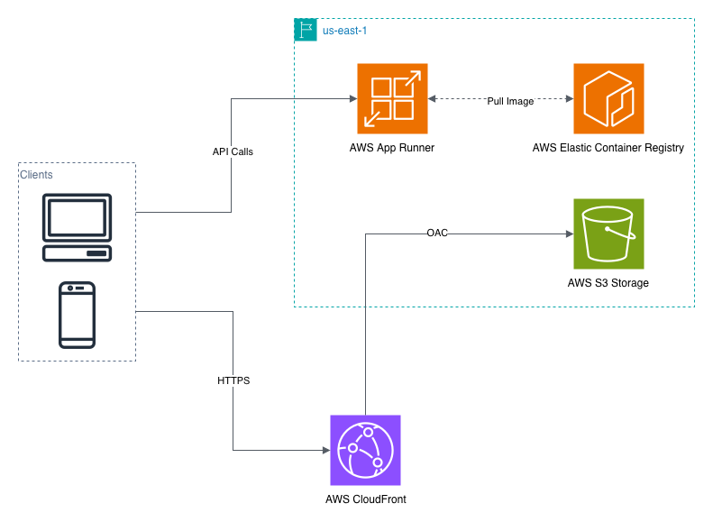

# 3 AI games for the Deep Learning Week Openhouse

A small application with React frontend + Node/Express backend + Python pose service. Backend runs on AWS App Runner (container from ECR). Frontend is a static build on S3 behind CloudFront.

## Architecture
Below is the high-level deployment flow:  


## Live endpoints
- API (App Runner): `https://wsi2xgmpev.us-east-1.awsapprunner.com`
- Frontend (Cloudfront): `https://d3vw39tqn7drbd.cloudfront.net`

## Local development
Prereqs: Node 20, npm, Python 3.10+, OpenCV/MediaPipe deps from `requirements.txt`.

1) Python env (pose service deps)
```bash
cd games
python -m venv .venv   # or use existing games/ venv
source .venv/bin/activate
pip install -r ../requirements.txt
```

2) Backend
```bash
cd backend
npm install
npm run dev  # runs TS via ts-node at http://localhost:5001
```

3) Frontend
```bash
cd frontend
npm install
npm start  # CRA dev server proxies API to http://localhost:5001
```

## Production build & deploy (summary)
- Backend: `docker buildx build --platform linux/amd64 -f backend/Dockerfile -t <acct>.dkr.ecr.<region>.amazonaws.com/ai-game-backend:latest --push .`
  - App Runner service listens on port 5001. Environment vars set in console; no .env baked.
- Frontend: `npm run build` in `frontend/`, upload `build/` to private S3, serve via CloudFront with OAC. Invalidate CF after updates.

## Environment variables (backend)
Set in App Runner (not in git):
- `PORT=5001`
- `AUTO_START_POSE=true` 
- `POSE_SERVICE_PORT=5002`
- `POSE_PYTHON=python3`
- (Optionally) `POSE_SERVICE_URL` if you externalize pose service.

## Data persistence note
Leaderboard is in-memory in the current build (no disk writes to avoid App Runner ephemeral storage). For shared/persistent scores, add DynamoDB later.

## Sensitive info
- `.env.production` should contain the public API base URL. 
```bash
REACT_APP_API_BASE_URL= <app runner API url>
```

## Health checks
- Backend exposes `/health` (200 OK) and `/` (200). App Runner health path can be `/health` on port 5001.

## Useful URLs
- App Runner logs/health: AWS Console > App Runner > ai-game-backend
- CloudFront invalidation (deploys): `aws cloudfront create-invalidation --distribution-id <DIST_ID> --paths "/*"`

## Testing pose endpoint locally
```bash
# with backend running locally on 5001
b64=$(base64 -w0 sample.jpg 2>/dev/null || base64 sample.jpg)
curl -i http://localhost:5001/api/pose \
  -H "Content-Type: application/json" \
  -d "{\"image\":\"$b64\"}"
```

---
